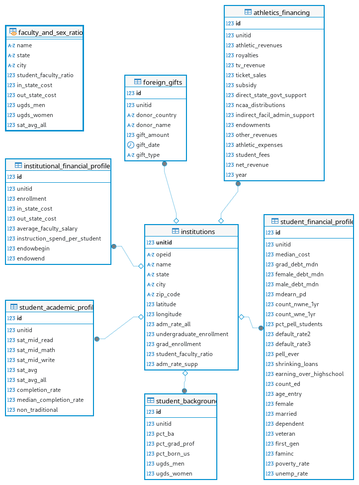

### ER diagram



### Table-creation statements

```sql
CREATE TABLE institutions ( --from `college_scorecard`
	unitid int PRIMARY KEY, --UNITID
	opeid varchar(16), --OPEID
	name varchar(128) NOT NULL, --INSTNM
	state varchar(2), --STABBR
	city varchar(64), --CITY
	zip_code varchar(10), --ZIP
	latitude float, --Latitude
	longitude float, --Longitude
	adm_rate_all float, --Admission rate for all campuses rolled up to the 6-digit OPE ID
	undergraduate_enrollment integer, --UGDS; number of undergraduate students
	grad_enrollment integer, --GRADS; number of graduate students
	student_faculty_ratio float, --STUFACR; undergraduate student to instructional faculty ratio
	adm_rate_supp float --Admission rate, suppressed for n<30
);

CREATE TABLE student_backgrounds ( --from `college_scorecard`
	id SERIAL PRIMARY KEY,
	unitid int REFERENCES institutions(unitid), --UNITID
	pct_ba float, --Percent of people over age 25 from students' zip codes with bachelor's degrees.
	pct_grad_prof float, --Percent of people over age 25 from students' zip codes with professional degrees.
	pct_born_us float, --Percent of people from students' zip codes that were born in the US.
	ugds_men float, --Total share of enrollment of undergraduate degree-seeking students who are men.
	ugds_women float --Total share of enrollment of undergraduate degree-seeking students who are women.
);

CREATE TABLE student_academic_profile ( --from `college_scorecard`
	id SERIAL PRIMARY KEY,
	unitid int REFERENCES institutions(unitid), --UNITID
	sat_mid_read float, --SATVRMID
	sat_mid_math float, --SATMTMID
	sat_mid_write float, --SATWRMID
	sat_avg float, --SAT_AVG
	sat_avg_all float, --Average SAT equivalent score of students admitted for all campuses rolled up to the 6-digit OPE ID
	completion_rate float, --C200_4_POOLED_SUPP
	median_completion_rate float, --MDCOMP_ALL; overall median of completion rate
	non_traditional float --UG25ABV; percentage of undergraduates aged 25 and above
);

CREATE TABLE student_financial_profile ( --from `college_scorecard`
	id SERIAL PRIMARY KEY,
	unitid int REFERENCES institutions(unitid), --UNITID
	median_cost float, --MDCOST_ALL; overall median for average net price.
	grad_debt_mdn float, --The median debt for students who have completed.
	female_debt_mdn float, --The median debt for female students.
	male_debt_mdn float, --The median debt for male students.
	mdearn_pd float, --Median earnings of students working and not enrolled 10 years after entry.
	count_nwne_1yr float, --Number of graduates working and not enrolled 1 year after completing.
	count_wne_1yr float, --Number of graduates not working and not enrolled 1 year after completing.
	pct_pell_students float, --PCTPELL
	default_rate2 float, --CDR2
	default_rate3 float, --CDR3
	pell_ever float, --PELL_EVER; share of students who received a Pell Grant while in school.
	shrinking_loans float, --RPY_7YR_RT
	earning_over_highschool float, --GT_THRESHOLD_P11; students earning more than a high school graduate 11 years after entry.
	count_ed integer, --Count of students in the earnings cohort.
	age_entry float, --Average age of entry.
	female float, --Share of female students.
	married float, --Share of married students.
	dependent float, --Share of dependent students.
	veteran float, --Share of veteran students.
	first_gen float, --Share of first-generation students.
	faminc float, --Average family income.
	poverty_rate float, --Poverty rate, via Census data.
	unemp_rate float --Unemployment rate, via Census data.
);

CREATE TABLE institutional_financial_profile ( --from `college_scorecard`
	id SERIAL PRIMARY KEY,
	unitid int REFERENCES institutions(unitid),
	in_state_cost integer, --TUITIONFEE_IN
	out_state_cost integer, --TUITIONFEE_OUT
	average_faculty_salary integer, --AVGFACSAL; average faculty salary
	instruction_spend_per_student int, --INEXPFTE
	endowbegin decimal(15, 2), --Value of school's endowment at the beginning of the fiscal year
	endowend decimal(15, 2) --Value of school's endowment at the end of the fiscal year
);

CREATE TABLE foreign_gifts ( --from `foreign_gifts`
	id SERIAL PRIMARY KEY,
	unitid int REFERENCES institutions(unitid),
	donor_country varchar(50), --"Country of Giftor"
	donor_name varchar(100), --"Giftor Name"
	gift_amount decimal(16, 2), --"Foreign Gift Amount"
	gift_date date, --"Foreign Gift Received"
	gift_type varchar(32) --"Gift Type"
);

CREATE TABLE athletics_financing ( --from `college_athletics_financing`
	id SERIAL PRIMARY KEY,
	unitid int REFERENCES institutions(unitid), --UNITID
	athletic_revenues decimal(15, 2), --Total revenue.
	royalties bigint, --Revenue from royalties.
	tv_revenue bigint, --Revenue from radio and television broadcasts.
	ticket_sales bigint, --Revenue received for sales of admissions to athletics events.
	subsidy int, --Direct state and institution subsidies.
	direct_state_govt_support bigint, --Direct support from state government.
	ncaa_distributions bigint, --Revenue received from participation in games.
	indirect_facil_admin_support bigint, --Facilities and services provided by the institution but not charged to athletics.
	endowments bigint, --Revenue from endowments and investments.
	other_revenues bigint, --Other revenues.
	athletic_expenses decimal(15, 2), --Total expenses.
	student_fees bigint, --Student fees for college athletics; reference from `student_financial_profile`.
	net_revenue bigint, --Athletic revenues minus athletic expenses.
	year int DEFAULT 2014 CHECK (year = 2014)
);
```

### View-creation statement

This view summarizes the ratios of students-to-faculty and males-to-females at each university that reported that data.
We did not revise this view for the final deliverable.

```sql
CREATE OR REPLACE VIEW faculty_and_sex_ratios AS
SELECT i.name, i.state, i.city, i.student_faculty_ratio,
	ifp.in_state_cost, ifp.out_state_cost,
	sb.ugds_men, sb.ugds_women,
	sap.sat_avg_all
FROM institutions AS i
JOIN student_backgrounds AS sb ON i.unitid = sb.unitid
JOIN student_academic_profile AS sap ON sb.unitid = sap.unitid
JOIN institutional_financial_profile AS ifp ON sap.unitid = ifp.unitid
WHERE sap.sat_avg_all IS NOT NULL
	AND i.student_faculty_ratio IS NOT NULL
	AND ifp.in_state_cost IS NOT NULL
	AND ifp.out_state_cost IS NOT NULL;
```

### Truncated listings of each table and view

### How we populated the database

Of the datasets we reported having collected in the first deliverable, we retained the following:

- The "College scorecard data"^[https://collegescorecard.ed.gov/data];
- _The Huffington post_ and _Chronicle of higher education_'s data on how colleges finance their athletics^[Described at http://projects.huffingtonpost.com/ncaa/reporters-note and directly downloadable from http://hpin.s3.amazonaws.com/ncaa-financials/ncaa-financials-data.zip.]; and
- The _Department of education_'s data on foreign gifts to and contracts with US colleges^[Described at https://studentaid.ed.gov/sa/about/data-center/school/foreign-gifts and downloadable from https://studentaid.gov/sites/default/files/ForeignGifts.xls.].

We rejected each of the other databases that we initially reported having collected owing either to its redundancy or to its mismatch with the date-ranges or reporting protocols of our other databases.
For instance, the dataset available from _Equity in athletics data analysis_ (EADA)^[Downloadable for selected years from https://ope.ed.gov/athletics/#/datafile/list.] reports data aggregated at the end of each academic year rather than at the end of the year proper.

We found that extensive pre-processing was required for each of our datasets despite limiting our study to a single year, about which more in the final deliverable.

### Questions, their formulations in english and SQL, the database's answers, along with any needful rationalization

We updated almost all of our questions, and came up with many new ones, to both better fit the limitations of our dataset and to reframe questions that could not be answered without additional statistical analysis
Admittedly, this is a bit of a "Man searches for keys under streetlamp" situation, but since this dataset is purely for educational and exploratory purposes (as opposed to forming part of the basis for an argument to some effect), we have decided not to sweat it.

#### Q0: How many graduate and undergraduate students are enrolled at reported schools?

```sql
SELECT i.name, i.state, i.city, i.undergraduate_enrollment, i.grad_enrollment
FROM colleges_2014.institutions AS i
WHERE (i.grad_enrollment IS NOT NULL) or (i.undergraduate_enrollment IS NOT NULL)
ORDER BY i.grad_enrollment DESC;
```


#### Q1: No. of undergraduate students and the insititution

```sql
SELECT i.name, i.state, i.city, i.undergraduate_enrollment
FROM colleges_2014.institutions AS i
WHERE i.undergraduate_enrollment IS NOT null
ORDER BY i.undergraduate_enrollment DESC;
```


#### Q2: No. of graduate students and the insititution

```sql
SELECT i.name, i.state, i.city, i.grad_enrollment
FROM colleges_2014.institutions AS i
WHERE i.grad_enrollment IS NOT null
ORDER BY i.grad_enrollment DESC;
```


#### Q3: Which schools report charging the highest in-state tuition?

```sql
SELECT i.name, i.state, i.city, ifp.in_state_cost
FROM colleges_2014.institutional_financial_profile AS ifp
JOIN colleges_2014.institutions AS i ON ifp.unitid = i.unitid
WHERE ifp.in_state_cost IS NOT NULL
ORDER BY ifp.in_state_cost DESC
LIMIT 10;
```


#### Q4: Which schools report lowest ratios between in-state and out-of-state tuition?

```sql
SELECT i.name, i.state, i.city, cast((cast(ifp.in_state_cost as float)/ifp.out_state_cost) AS numeric(7,6)) AS in_to_out
FROM colleges_2014.institutional_financial_profile AS ifp
JOIN colleges_2014.institutions AS i ON ifp.unitid = i.unitid
WHERE ifp.in_state_cost IS NOT NULL
ORDER BY in_to_out ASC;
```


#### Q5: How much education have people endured in the areas where the students at institutions with the lowest in-state to out-of-state tuition ratios come from?

The present dataset doesn't allow for answering this question because apparently `pct_ba` and `pct_grad_prof` weren't being reported or gathered in 2014.

```sql
SELECT i.name, i.state, i.city,
	cast((cast(ifp.in_state_cost AS float)/ifp.out_state_cost)
		AS numeric(7,6)) AS in_to_out,
	sb.pct_ba, sb.pct_grad_prof
FROM colleges_2014.institutional_financial_profile AS ifp
JOIN colleges_2014.institutions AS i ON ifp.unitid = i.unitid
JOIN colleges_2014.student_backgrounds AS sb ON ifp.unitid = sb.unitid
WHERE ifp.in_state_cost IS NOT NULL
ORDER BY in_to_out ASC;
```


#### Q6: What are SAT scores like in the reported schools with the lowest ratios of in-state to out-of-state tuition?

```sql
SELECT i.name, i.state, i.city,
	cast((cast(ifp.in_state_cost AS float)/ifp.out_state_cost)
		AS numeric(7,6)) AS in_to_out,
	sap.sat_avg_all
FROM colleges_2014.institutional_financial_profile AS ifp
JOIN colleges_2014.institutions AS i ON ifp.unitid = i.unitid
JOIN colleges_2014.student_academic_profile AS sap ON ifp.unitid = sap.unitid
WHERE ifp.in_state_cost IS NOT NULL AND sap.sat_avg_all IS NOT NULL
ORDER BY in_to_out ASC;
```


#### Q7: Which schools accepted the most money from foreign donors in 2014?

```sql
SELECT i.name, i.state, sum(fg.gift_amount) AS gift_sum
FROM colleges_2014.foreign_gifts AS fg
JOIN colleges_2014.institutions AS i ON fg.unitid = i.unitid
GROUP BY i.unitid
ORDER BY gift_sum DESC
LIMIT 10;
```


#### Q8: What is instructional spending like at those schools?

```sql
SELECT i.name, i.state, sum(fg.gift_amount) AS gift_sum, ifp.instruction_spend_per_student
FROM colleges_2014.foreign_gifts AS fg
JOIN colleges_2014.institutions AS i ON fg.unitid = i.unitid
JOIN colleges_2014.institutional_financial_profile AS ifp ON fg.unitid = ifp.unitid
GROUP BY i.unitid, ifp.instruction_spend_per_student
ORDER BY gift_sum DESC
LIMIT 10;
```


#### Q9: How profitable are sports at schools that reported foreign gifts?

```sql
SELECT i.name, i.state, sum(fg.gift_amount) AS gift_sum,
	cast(ifp.instruction_spend_per_student AS numeric(9,2)), af.net_revenue AS net_revenue
FROM colleges_2014.foreign_gifts AS fg
JOIN colleges_2014.institutions AS i ON fg.unitid = i.unitid
JOIN colleges_2014.institutional_financial_profile AS ifp ON fg.unitid = ifp.unitid
JOIN colleges_2014.athletics_financing AS af ON fg.unitid = af.unitid
GROUP BY i.unitid, ifp.instruction_spend_per_student,
	af.athletic_revenues, af.athletic_expenses, af.net_revenue
ORDER BY gift_sum DESC;
```


#### Q10: How profitable are sports at schools that gave a report as to whether or not their sports-related doings are profitable?

```sql
SELECT i.name, i.state, cast(ifp.instruction_spend_per_student AS numeric(9,2)),
	af.net_revenue AS net_revenue
FROM colleges_2014.institutions AS i
JOIN colleges_2014.institutional_financial_profile AS ifp ON i.unitid = ifp.unitid
JOIN colleges_2014.athletics_financing AS af ON i.unitid = af.unitid
GROUP BY i.unitid, ifp.instruction_spend_per_student,
	af.athletic_revenues, af.athletic_expenses, af.net_revenue
ORDER BY ifp.instruction_spend_per_student DESC;
```


#### Q11: How is the profitibility of sports distributed among schools?

```sql
SELECT cast(avg(af.net_revenue) AS numeric(10,2)) AS mean,
	cast(percentile_cont(0.5) WITHIN GROUP
		(ORDER BY af.net_revenue) AS numeric(10,2)) AS median,
	cast(MODE() WITHIN GROUP (ORDER BY af.net_revenue) AS numeric(10,2)) AS mode,
	cast(stddev(af.net_revenue) AS numeric(10,2)) AS standard_deviation
FROM colleges_2014.athletics_financing as af;
```


#### Q12: Which country donated most frequently to each school that reported foreign gifts?

```sql
SELECT i.name, fg.unitid,
	MODE() WITHIN GROUP (ORDER BY fg.donor_country) AS top_donor
FROM colleges_2014.foreign_gifts AS fg
join colleges_2014.institutions as i on fg.unitid = i.unitid
GROUP BY i.name, fg.unitid;
```


#### Q13: And again, but with a CTE:

```sql
WITH top_donor AS (
	SELECT fg.unitid,
		MODE() WITHIN GROUP (ORDER BY fg.donor_country) AS top_donor
	FROM colleges_2014.foreign_gifts AS fg
	GROUP BY fg.unitid
)
SELECT i.name, td.top_donor
FROM colleges_2014.foreign_gifts AS fg
JOIN colleges_2014.institutions AS i ON fg.unitid = i.unitid
JOIN top_donor AS td ON fg.unitid = td.unitid
GROUP BY i.name, td.top_donor;
```


#### Q14: And again in still more convoluted fashion, but this time listing the top three donor countries for each university.

```sql
WITH donor_ranks AS (
	SELECT fg.unitid, fg.donor_country, count(*) AS n_gifts,
		ROW_NUMBER() OVER (PARTITION BY fg.unitid ORDER BY count(*) DESC,
			fg.donor_country) AS rank,
		sum(fg.gift_amount) AS total
	FROM colleges_2014.foreign_gifts as fg
	GROUP BY unitid, donor_country
)
SELECT i.name, dr.donor_country AS top_donor, dr.total, rank
FROM donor_ranks AS dr
JOIN colleges_2014.institutions AS i on dr.unitid = i.unitid
WHERE rank = 1 OR rank = 2 OR rank = 3
ORDER BY i.name ASC, dr.total DESC;
```


#### Q15: Which countries donated the most money, and how much did each one donate?

```sql
SELECT fg.donor_country, sum(gift_amount) AS donated
FROM colleges_2014.foreign_gifts AS fg
GROUP BY fg.donor_country
ORDER BY donated DESC
LIMIT 10;
```


#### Q16: Which country donated most often?

```sql
SELECT MODE() WITHIN GROUP (ORDER BY fg.donor_country) AS donor
FROM colleges_2014.foreign_gifts AS fg;
```


#### Q17: Which of the schools in Oregon that report average SAT scores, in-state tuition, and out-of-state tuition have the lowest student-to-faculty ratios?

```sql
SELECT i.name, i.state, i.city, i.student_faculty_ratio
FROM colleges_2014.institutions AS i
JOIN colleges_2014.student_backgrounds AS sb ON i.unitid = sb.unitid
JOIN colleges_2014.student_academic_profile AS sap ON sb.unitid = sap.unitid
JOIN colleges_2014.institutional_financial_profile AS ifp ON sap.unitid = ifp.unitid
WHERE sap.sat_avg_all IS NOT NULL
	AND i.student_faculty_ratio IS NOT NULL
	AND ifp.in_state_cost IS NOT NULL
	AND ifp.out_state_cost IS NOT NULL
	AND i.state = 'OR'
ORDER BY i.student_faculty_ratio;
```


#### Q18: How much does each of those schools spend directly on instructing students?

```sql
SELECT i.name, i.state, i.city, i.student_faculty_ratio, ifp.instruction_spend_per_student
FROM colleges_2014.institutions AS i
JOIN colleges_2014.student_backgrounds AS sb ON i.unitid = sb.unitid
JOIN colleges_2014.student_academic_profile AS sap ON sb.unitid = sap.unitid
JOIN colleges_2014.institutional_financial_profile AS ifp ON sap.unitid = ifp.unitid
WHERE sap.sat_avg_all IS NOT NULL
	AND i.student_faculty_ratio IS NOT NULL
	AND ifp.in_state_cost IS NOT NULL
	AND ifp.out_state_cost IS NOT NULL
	AND i.state = 'OR'
ORDER BY i.student_faculty_ratio;
```


#### Q19: Of those, which are included in the athletics financing database and what are their net revenues from athletics, broadly construed?

```sql
SELECT i.name, i.state, i.city, i.student_faculty_ratio,
	af.athletic_revenues, af.athletic_expenses,
	(af.athletic_revenues - af.athletic_expenses) AS net
FROM colleges_2014.institutions AS i
JOIN colleges_2014.student_backgrounds AS sb ON i.unitid = sb.unitid
JOIN colleges_2014.student_academic_profile AS sap ON sb.unitid = sap.unitid
JOIN colleges_2014.institutional_financial_profile AS ifp ON sap.unitid = ifp.unitid
JOIN colleges_2014.athletics_financing AS af ON i.unitid = af.unitid
WHERE sap.sat_avg_all IS NOT NULL
	AND i.student_faculty_ratio IS NOT NULL
	AND ifp.in_state_cost IS NOT NULL
	AND ifp.out_state_cost IS NOT NULL
	AND i.state = 'OR'
ORDER BY i.student_faculty_ratio;
```


#### Q20: Which schools' graduates have the highest median debt?

```sql
SELECT i.name, i.state, i.city, sfp.grad_debt_mdn
FROM colleges_2014.student_financial_profile AS sfp
JOIN colleges_2014.institutions AS i on sfp.unitid = i.unitid
WHERE sfp.grad_debt_mdn IS NOT NULL
ORDER BY sfp.grad_debt_mdn DESC
LIMIT 10;
```


#### Q21: Do the schools with the largest sports subsidies have fewer students from low income or first-to-attend-college backgrounds?

(There doesn't seem to be any correlation.)

```sql
SELECT i.name, i.state, sfp.pell_ever, sfp.first_gen, af.subsidy
FROM colleges_2014.student_financial_profile AS sfp
JOIN colleges_2014.institutions AS i ON sfp.unitid = i.unitid
JOIN colleges_2014.athletics_financing AS af ON af.unitid = i.unitid;
```


#### Q22: Do schools that spend more on student instruction have higher faculty salaries?

(They have more money, so yes.)

```sql
SELECT i.name, i.state, ifp.average_faculty_salary, ifp.instruction_spend_per_student
FROM colleges_2014.institutional_financial_profile AS ifp
JOIN colleges_2014.institutions AS i ON ifp.unitid = i.unitid;
```


#### Q23: Which of the colleges that responded pay the most per student sports in the undergrad program?

```sql
SELECT i.name, (af.athletic_expenses - af.student_fees) / i.undergraduate_enrollment AS sports_pay_per_student
FROM colleges_2014.institutions i
JOIN colleges_2014.athletics_financing af ON i.unitid = af.unitid
WHERE af.athletic_expenses IS NOT NULL
    AND i.undergraduate_enrollment > 0
ORDER by sports_pay_per_student DESC
LIMIT 10;
```


#### Q24: Which of the colleges that responded pay the most per student sports in the grad program?

```sql
SELECT i.name,(af.athletic_expenses - af.student_fees) / i.grad_enrollment AS sports_pay_per_student
FROM colleges_2014.institutions i
JOIN colleges_2014.athletics_financing af ON i.unitid = af.unitid
WHERE af.athletic_expenses IS NOT NULL
    AND i.grad_enrollment > 0
ORDER by sports_pay_per_student DESC
LIMIT 10;
```


#### Q25: How many students are involved in both academics and sports?

```sql
SELECT i.name as college_name, SUM(i.undergraduate_enrollment) AS no_of_students_in_sports
FROM colleges_2014.institutions i
WHERE i.unitid IN (SELECT DISTINCT unitid FROM colleges_2014.athletics_financing)
GROUP BY i.name
ORDER BY no_of_students_in_sports DESC;
```


#### TODO Q26: Which schools and colleges that also report students' sexes report the lowest student-faculty ratios?

This question relies on the `faculty_and_sex_ratios` view.

```sql
SELECT fsr.name, fsr.state, fsr.city, fsr.student_faculty_ratio
FROM faculty_and_sex_ratios AS fsr
WHERE fsr.student_faculty_ratio IS NOT NULL
ORDER BY fsr.student_faculty_ratio ASC
LIMIT 15;
```
